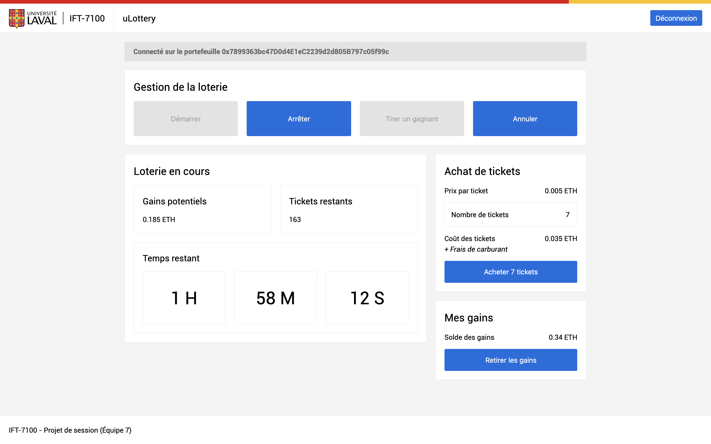

# Projet Solidity 2024 - uLottery


__Bienvenue dans la documentation du projet !__

Ce projet a été réalisé dans le cadre du cours d'**Aspects pratiques de la chaîne de blocs (IFT-7100)** à l'Université Laval.

uLottery est une application de loterie décentralisée qui utilise la chaîne de blocs Ethereum.



## Consignes du projet

__[:page_facing_up: Énoncé du projet](ressources/enonce.pdf)__

## Organisation du projet

* __[:framed_picture: images/](images/)__

  Images présentent dans cette documentation.

* __[:volcano: ressources/](ressources/)__

  Ressources utiles au développement du projet.

* __[:rocket: source/](source/)__

  Dossier principal contenant le code source du projet.

## Installation du projet

1. Lancer un terminal dans le dossier [source/](source/).

2. Installer les librairies `npm i`.

3. Compiler le projet `npm run build`.

3. Démarrer le projet `npm run start`.

## Contrat intelligent

__[:pencil2: Code du contrat](source/contracts/ULottery.sol)__

---

### Déploiement du contrat

1. Déployer le contrat sur la chaîne de blocs.

2. Lancer un terminal dans le dossier [source/](source/).

3. Compiler le contrat `npm run compile`.

4. Modifier le fichier « [/app/lottery.js](source/app/lottery.js) ».

   ```javascript
   const Provider = new Web3.providers.WebsocketProvider(
      "wss://localhost" // Adresse du serveur WebSocket
   );

   const abi = [...]; // Contenu du fichier ABI compilé dans le dossier build
   const Lottery = new web3.eth.Contract(abi, "0xADDRESS"); // Adresse du contrat
   ```

5. Compiler le projet `npm run build`.

6. Démarrer le projet `npm run start`.
